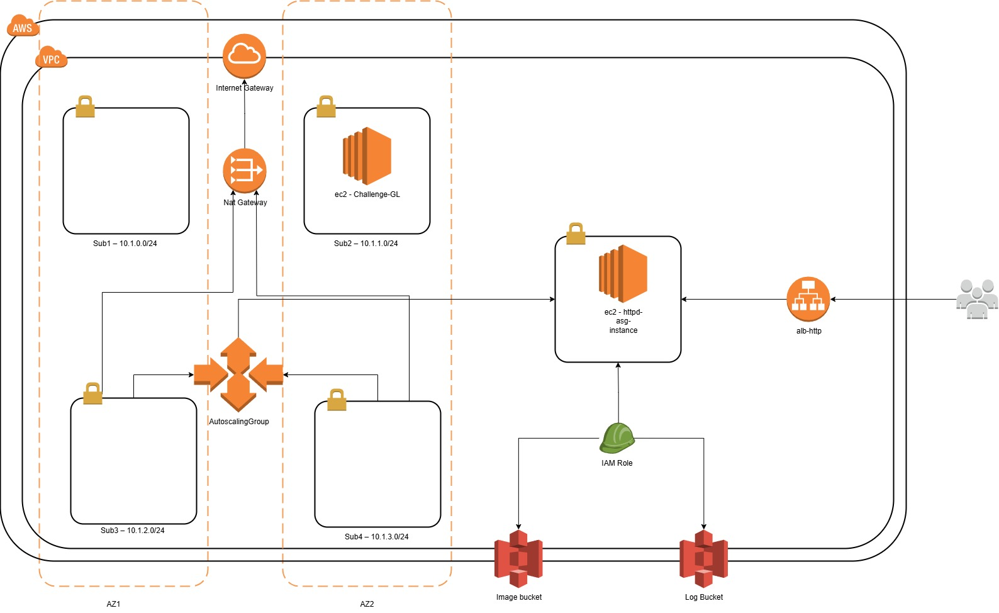
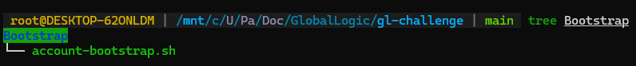
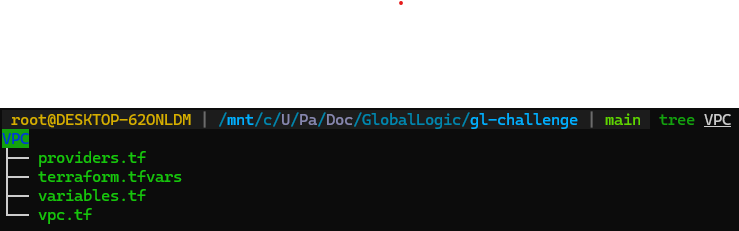
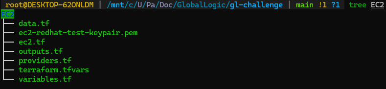
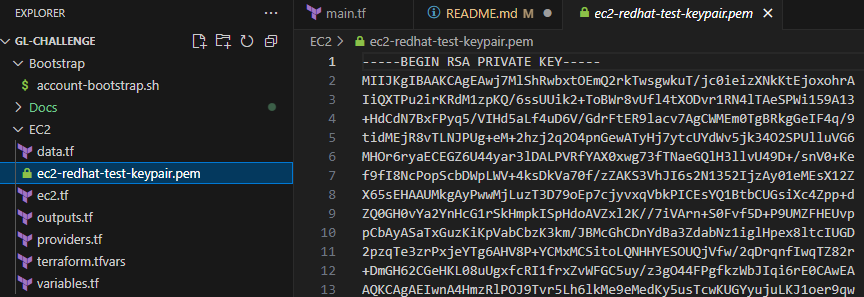
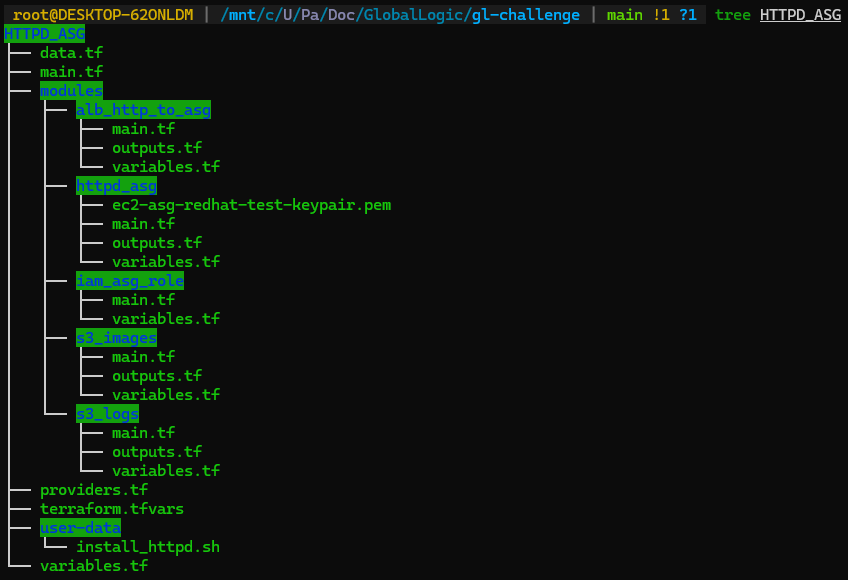
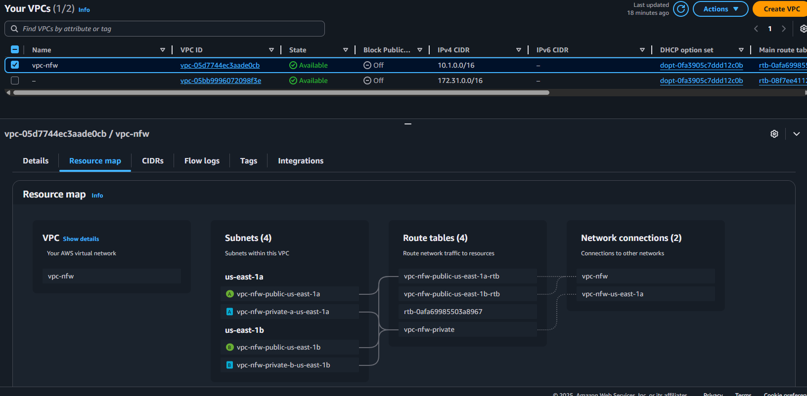

# Description

This project implements an infrastructure on AWS using Terraform with standalone and modular deployments, as part of a technical challenge for GlobalLogic.

The solution includes:

- Provisioning of a (**VPC**) with public and private subnets distributed across multiple availability zones.
- Automatic deployment of EC2 instances using **Auto Scaling Groups (ASG)** with load balancing configuration.
- Implementation of an **Application Load Balancer (ALB)** that exposes the application to the public on port 80 and redirects internal traffic to port 443.
- Definition of **custom IAM roles** with specific permissions for bucket access and log generation.
- Configuration of **S3 buckets** with object lifecycle and expiration rules for image and log storage.

The environment was developed following IaC best practices.


## Solution Overview

This solution corresponds to a technical challenge, meeting the criteria described in the submitted challenge:

## 🔷 VPC

- 4 subnets (spread evenly across two availability zones):
  - `Sub1 – 10.1.0.0/24 (should be accessible from internet)`
  - `Sub2 – 10.1.1.0/24 (should be accessible from internet)`
  - `Sub3 – 10.1.2.0/24 (should NOT be accessible from internet)`
  - `Sub4 – 10.1.3.0/24 (should NOT be accessible from internet)`

## 🔷 EC2 Instance

- Located in **sub2**
- AMI: **Red Hat Linux**
- Specs: `t2.micro`, `20 GB storage`

## 🔷 Auto Scaling Group (ASG)

- Subnets: `sub3` y `sub4`
- AMI: **Red Hat Linux**
- Specs: `t2.micro`, 2 minimum, 6 maximum hosts
- Script: installing Apache web server (`httpd`)
- IAM Role: read access to the bucket `images`
- Security Group: allows necessary traffic

## 🔷 Application Load Balancer (ALB)

- Listen in port **80 (HTTP)**
- Redirect traffic to ASG in **puerto 443**
- (ALB) listen on TCP port 80 (HTTP) and forwards traffic to the ASG in subnets  `sub3` and `sub4` on port 443 


## 🔷 IAM Role

- Allows writing to the `logs` bucket from auto-scaled EC2s
- Allows reading of the `images` bucket from auto-scaled EC2s

## 🔷 S3 Buckets

### Bucket: `Images`
- Folder: `/archive`
- `Memes` folder: Move objects older than 90 days to **Glacier**

### Bucket: `Logs`
- Active folder: Move >90 days to **Glacier**
- Inactive folder: Delete objects >90 days old


### Solution Diagram:



---

# 🚀 Deployment Instructions

## Account Bootstrap

This script is **NOT part of the requirements**, but is included to initialize the Terraform remote backend. It is assumed that the AWS account where the deployment will be performed is a new account, as is my case.


### Purpose

- Create KMS Key with Aliases and Policies.
- Create S3 Bucket for Terraform States with KMS Encryption
- Create a remote backend environment with terraform-state control and locking.
- Create DynamoDB Table for Locking

---

### Execution steps

To deploy it, clone the repository and position yourself in the “Bootstrap” folder.



```bash
cd Bootstrap/
chmod +x bootstrap.sh
./bootstrap.sh
```

---

## VPC

The VPC module is based on the public Coalfire module [`terraform-aws-vpc-nfw`](https://github.com/Coalfire-CF/terraform-aws-vpc-nfw), which meets all the requirements of the challenge.
This deployment should be the first in the chain and should be done independently, following good infrastructure practices, as it is recommended that the VPC remain active even if other resources are deleted or recreated. 

### Execution steps

To deploy it, clone the repository and position yourself in the “VPC” folder.



```bash
cd VPC/
terraform init
terraform plan
terraform apply
```

---

## EC2 Instance

This deployment is based on the public Coalfire module [`terraform-aws-ec2`](https://github.com/Coalfire-CF/terraform-aws-ec2). It runs independently since the challenge interpretation assumes that this instance has no direct influence on the other deployments, so it can be used for any other purpose, such as being a bastion host to access other instances.

### Execution steps

To deploy it, clone the repository and position yourself in the “EC2” folder.



```bash
cd EC2/
terraform init
terraform plan
terraform apply
```

> This deployment generates a unique keypair that allows access to the instance via SSH. The template logic is designed to place the `.pem` file in the local folder of the deployment module. It should be moved to a secure vault (you can use Secrets Manager).



---

## HTTPD_ASG

This project implements multiple resources that fully meet the requested requirements. It is modularized to maintain code reusability, scalability, and clarity.

- Main objectives:
    - Create an Auto Scaling Group (ASG) distributed across private subnets. Distribute instances across subnets sub3 and sub4.
    - Create a Launch Template to deploy Red Hat Linux instances with HTTPD.
    - Deploy an Application Load Balancer that accepts HTTP traffic (port 80) from the Internet. It must also redirect incoming traffic to the ASG on port 443.
    - Create S3 buckets for logs and image repositories with specific conditions (Lifecycle Rules and object expiration).
    - Create a role that allows instances launched from the ASG to interact with the previously created buckets.
    - Define specific Security Groups for each component.

### Execution steps

To deploy it, clone the repository and position yourself in the “HTTPD_ASG” folder.



```bash
cd EC2/
terraform init
terraform plan
terraform apply
```

---

## Design Decisions

- **Remote Backend and Terraform-State Locking**: Bootstrap automatizado (S3 + DynamoDB + KMS):
    - An automated bootstrap was designed to create the remote Terraform backend using an S3 bucket with KMS encryption.
    - A DynamoDB table for lock control.

This ensures security, state versioning, and prevents conflicts in concurrent deployments.

- **VPC Deployment**: It was decided to implement the VPC as a separate deployment from the rest of the resources to ensure that its administration and maintainability are separate from the infrastructure deployment proposed in the challenge.
This same VPC can be used for future projects that need to coexist with the components deployed here. This decision is based on maintaining the VPC as a persistent deployment, even if the rest of the resources are seized.

- **EC2 Deployment**: It was decided that the deployed instance would also be deployed independently. It was assumed that it had functionality and utilization outside of the scalable and resilient structure posed by the challenge. It was considered that it could be used as a test scenario or perhaps a bastion-host instance to access the automated deployment instances.

- **IAM Roles, unified**: The requirements require provisioned instances to be able to read from the `images` bucket, but they also require provisioned instances to be able to write logs to the `logs` bucket. Since a Launch template can technically only assume one Instance Profile, it is considered to do so in a single role.

---

## 🔗 References

- Remote backend: [Terraform Remote State](https://developer.hashicorp.com/terraform/language/state/remote)
- VPC Module: [`terraform-aws-vpc-nfw`](https://github.com/Coalfire-CF/terraform-aws-vpc-nfw)
- EC2: [`terraform-aws-ec2`](https://github.com/Coalfire-CF/terraform-aws-ec2)
- AWS Resources:
  - [Load Balancer](https://registry.terraform.io/providers/hashicorp/aws/latest/docs/resources/lb)
  - [Target Group](https://registry.terraform.io/providers/hashicorp/aws/latest/docs/resources/lb_target_group)
  - [Listener](https://registry.terraform.io/providers/hashicorp/aws/latest/docs/resources/lb_listener)
  - [Security Group](https://registry.terraform.io/providers/hashicorp/aws/latest/docs/resources/security_group)
  - [Auto Scaling Group](https://registry.terraform.io/providers/hashicorp/aws/latest/docs/resources/autoscaling_group)
  - [IAM Role](https://registry.terraform.io/providers/hashicorp/aws/latest/docs/resources/iam_role)
  - [S3 Buckets](https://registry.terraform.io/providers/hashicorp/aws/latest/docs/resources/s3_bucket)
  - [Download Key Pair Locally](https://stackoverflow.com/questions/67389324/create-a-key-pair-and-download-the-pem-file-with-terraform-aws)

---

### Improvement Plan

This improvement plan aims to list opportunities to optimize the security, maintainability, scalability, and observability of this project. A series of prioritized actions are proposed to strengthen the design.

- Replace the use of PEM keys with Session Manager.
- Create custom images that include a hardening plan.
- Store the PEM file in a secure location; it can be stored in Secrets Manager or SSM Parameter Store.
- Reuse S3 modules. Two different modules are currently used to create buckets. A customizable module can be created using variables.


## Analysis of Operational Gaps

- Access to EC2 instances: Currently relies on an insecurely stored locally PEM certificate, in addition to having to open port 22 in the Security Group ingress rules. SSM is not used to access instances without relying on the certificate, nor is a secure access PEM storage solution orchestrated.

- Lack of active monitoring and alerting: The Cloudwatch agent is not installed, and Log Groups are not defined to send metrics to CloudWatch. Therefore, any issues may go unnoticed due to the lack of the necessary agents and Log Groups.

- IAM policies are being defined within each module, rather than centralized in a specific module that manages policy deployment and control in a unified manner. This makes it difficult to maintain and scale permissions as the infrastructure grows.

---

# Evidence of Deployments

This section contains direct evidence of the successful provisioning of infrastructure using Terraform. As required, we include:
- Screenshots of running AWS Resorces
- CLI commands used in each deployment
- Full Terraform `apply` logs

## VPC
### `terraform apply` log

The `terraform apply` command was executed to deploy the infrastructure resources.

- The following is an extract from the log, which is stored in full at [`docs/vpc_apply.log`](docs/vpc_apply.log):


VPC deployed:



# EC2
### `terraform apply` log

The `terraform apply` command was executed to deploy the infrastructure resources.

 - The following is an extract from the log, which is stored in full at [`docs/ec2_apply.log`](docs/ec2_apply.log):
 
Instance running:
:


#### InstanceType, Platform, subnet and volume

InstanceType and Platform
```bash
aws ec2 describe-instances \      ok | %
  --instance-ids i-012f4238cc4d123c7 \
  --query "Reservations[0].Instances[0].{InstanceType:InstanceType, SubnetId:SubnetId, PlatformDetails:PlatformDetails, VolumeId:BlockDeviceMappings[0].Ebs.VolumeId}" \
  --output table

---------------------------------------------------------------------------------------------------
|                                        DescribeInstances                                        |
+-------------+----------------------------+----------------------------+-------------------------+
|InstanceType |      PlatformDetails       |         SubnetId           |        VolumeId         |
+-------------+----------------------------+----------------------------+-------------------------+
|  t2.micro   |  Red Hat Enterprise Linux  |  subnet-05aa156cf6143c417  |  vol-0f504f9d433af95c4  |
+-------------+----------------------------+----------------------------+-------------------------+
```

Subnet:
```bash
aws ec2 describe-subnets \
  --subnet-ids subnet-05aa156cf6143c417 \
  --query "Subnets[0].Tags[?Key=='Name'].Value" \
  --output text

vpc-nfw-public-us-east-1b
```
Volume Size:
```bash
aws ec2 describe-volumes \
  --volume-ids vol-0f504f9d433af95c4 \
  --query "Volumes[0].Size" \
  --output text

20
```
# Httpd Autoscalling

:

ASG Subnets:

```bash
aws autoscaling describe-auto-scaling-groups \
  --auto-scaling-group-names httpd-asg \
  --query "AutoScalingGroups[0].VPCZoneIdentifier" \
  --output text

subnet-0dd4f28eb779df644,subnet-0ac2889d058fe9f7a
```

```bash
aws ec2 describe-subnets \
  --subnet-ids subnet-0dd4f28eb779df644 subnet-0ac2889d058fe9f7a \
  --query "Subnets[].{SubnetId:SubnetId, Name: Tags[?Key=='Name']|[0].Value}" \
  --output table
  
--------------------------------------------------------------
|                       DescribeSubnets                      |
+-------------------------------+----------------------------+
|             Name              |         SubnetId           |
+-------------------------------+----------------------------+
|  vpc-nfw-private-a-us-east-1a |  subnet-0dd4f28eb779df644  |
|  vpc-nfw-private-b-us-east-1b |  subnet-0ac2889d058fe9f7a  |
+-------------------------------+----------------------------+
```

Provisioned Instances:

```bash
aws ec2 describe-launch-template-versions \
  --launch-template-id lt-0221f2b9dc4b414d6 \
  --versions 1 \
  --query "LaunchTemplateVersions[0].LaunchTemplateData.{InstanceType:InstanceType, StorageSize:BlockDeviceMappings[0].Ebs.VolumeSize}" \
  --output table

---------------------------------
|DescribeLaunchTemplateVersions |
+---------------+---------------+
| InstanceType  |  StorageSize  |
+---------------+---------------+
|  t2.micro     |  20           |
+---------------+---------------+
```

```bash
ec2 describe-launch-template-versions \
  --launch-template-id lt-0221f2b9dc4b414d6 \
  --versions 1 \
  --query "LaunchTemplateVersions[0].LaunchTemplateData.ImageId" \
  --output text

ami-0a74a0465cdeea9b3
```

SO Running:
```bash
aws ec2 describe-images \ 
    --image-ids ami-0a74a0465cdeea9b3 \
    --query 'Images[0].PlatformDetails' \
    --output text

Red Hat Enterprise Linux
```

User-data script to install httpd on instances:

```bash
 aws ec2 describe-launch-template-versions \     --launch-template-id lt-0221f2b9dc4b414d6 \
  --versions 1 \
  --query "LaunchTemplateVersions[0].LaunchTemplateData.UserData" \
  --output text | base64 --decode

#!/bin/bash

# Install httpd & mod_ssl
yum update -y
yum install -y httpd mod_ssl

systemctl enable httpd

# Comment to avoid conflicts and duplications in the CFG
sed -i 's/^Listen 443/#Listen 443/' /etc/httpd/conf/httpd.conf

mkdir -p /etc/httpd/ssl

# Generate self-signed certificate
openssl req -x509 -nodes -days 3650 -newkey rsa:2048 \
  -keyout /etc/httpd/ssl/selfsigned.key \
  -out /etc/httpd/ssl/selfsigned.crt \
  -subj "/C=US/ST=State/L=City/O=Org/OU=Unit/CN=$(hostname -f)"

echo 'LogFormat "%h %l %u %t \"%%r\" %>s %b \"%{Referer}i\" \"%{User-Agent}i\" %%p" combined_with_port' >> /etc/httpd/conf/httpd.conf


# Create VHost 443
cat > /etc/httpd/conf.d/vhost_https.conf <<EOF
<VirtualHost *:443>
    DocumentRoot "/var/www/html"
    ServerName $(hostname -f)

    SSLEngine on
    SSLCertificateFile /etc/httpd/ssl/selfsigned.crt
    SSLCertificateKeyFile /etc/httpd/ssl/selfsigned.key

    <Directory "/var/www/html">
        Require all granted
    </Directory>
</VirtualHost>
EOF

# Create VHost 80
cat > /etc/httpd/conf.d/vhost_http.conf <<EOF
<VirtualHost *:80>
    DocumentRoot "/var/www/html"
    ServerName $(hostname -f)

    <Directory "/var/www/html">
        Require all granted
    </Directory>
</VirtualHost>
EOF


echo "Apache HTTP and HTTPS OK - $(hostname -f)" > /var/www/html/index.html

systemctl restart httpd
```

IAM Role:

```bash
aws iam get-role --role-name asg-consolidated-role
```

```json
{
    "Role": {
        "Path": "/",
        "RoleName": "asg-consolidated-role",
        "RoleId": "AROA5BLAM74CJ6RCWTSTO",
        "Arn": "arn:aws:iam::896239730436:role/asg-consolidated-role",
        "CreateDate": "2025-07-30T22:02:50+00:00",
        "AssumeRolePolicyDocument": {
            "Version": "2012-10-17",
            "Statement": [
                {
                    "Effect": "Allow",
                    "Principal": {
                        "Service": "ec2.amazonaws.com"
                    },
                    "Action": "sts:AssumeRole"
                }
            ]
        },
        "MaxSessionDuration": 3600,
        "Tags": [
            {
                "Key": "Environment",
                "Value": "Demo"
            },
            {
                "Key": "Project",
                "Value": "GL Challenge"
            },
            {
                "Key": "Repository",
                "Value": "https://github.com/pabloaval01/gl-challenge/tree/main/HTTPD_ASG"
            },
            {
                "Key": "Owner",
                "Value": "Pablo Valentino"
            },
            {
                "Key": "Terraform",
                "Value": "True"
            }
        ],
        "RoleLastUsed": {}
    }
}
```

Instance Profile:

```bash
#Instance Profile used in the Launch Template
aws ec2 describe-launch-template-versions \
  --launch-template-id lt-0221f2b9dc4b414d6 \
  --versions $(aws ec2 describe-launch-templates \
    --launch-template-ids lt-0221f2b9dc4b414d6 \
    --query 'LaunchTemplates[0].LatestVersionNumber' \
    --output text) \
  --query "LaunchTemplateVersions[0].LaunchTemplateData.IamInstanceProfile.Name" \
  --output text

asg-instance-profile
```

```bash
#Role linked to the Instance Profile
aws iam get-instance-profile \
  --instance-profile-name asg-instance-profile \
  --query "InstanceProfile.Roles[0].RoleName" \
  --output text

asg-consolidated-role

```bash
#InstanceProfile attached to the Launch Template
aws ec2 describe-launch-template-versions \
  --launch-template-id lt-0221f2b9dc4b414d6 \
  --versions $(aws ec2 describe-launch-templates \
    --launch-template-ids lt-0221f2b9dc4b414d6 \
    --query 'LaunchTemplates[0].LatestVersionNumber' \
    --output text) \
  --query "LaunchTemplateVersions[0].LaunchTemplateData.IamInstanceProfile" \
  --output json
```
```json
{
    "Name": "asg-instance-profile"
}
```